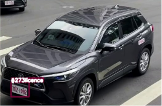

# 未禮讓行人違規辨識結果展示
#### 車牌辨識：https://github.com/wenchun0731/plates-identify
系統包含使用YoloV8進行行人、車輛、車牌的追蹤，以及使用OpenCV完成車牌辨識、尋找行人穿越線的邊界，最後取得車輛及行人的座標判斷是否違規。未禮讓行人違規定義為:當車輛與行人前後距離小於三個枕木紋，車輛即算違規。
|                   |                   |
|-------------------|-------------------|
|車輛未碰到行人穿越線，為綠色追蹤框。|此時車輛與行人皆在行人穿越線內並且距離小於三個枕木紋，判斷違規。|
|||
|違規車輛追蹤框變為紅色|擷取車輛及車牌照片，進行車牌辨識，放入資料庫。|
|||

## 影片未禮讓行人違規辨識
#### 因為無法拍攝到違規，所以自行製作行人框(id:1000 Person)來展示未禮讓行人違規辨識的可行性

https://github.com/user-attachments/assets/f72bc4ff-7bf6-4043-9117-569ac61ef501

https://github.com/user-attachments/assets/b387d617-4f49-496e-88d6-3a06226fe11e

https://github.com/user-attachments/assets/43b83ef3-01e9-479a-a75e-178fd5c5927b

